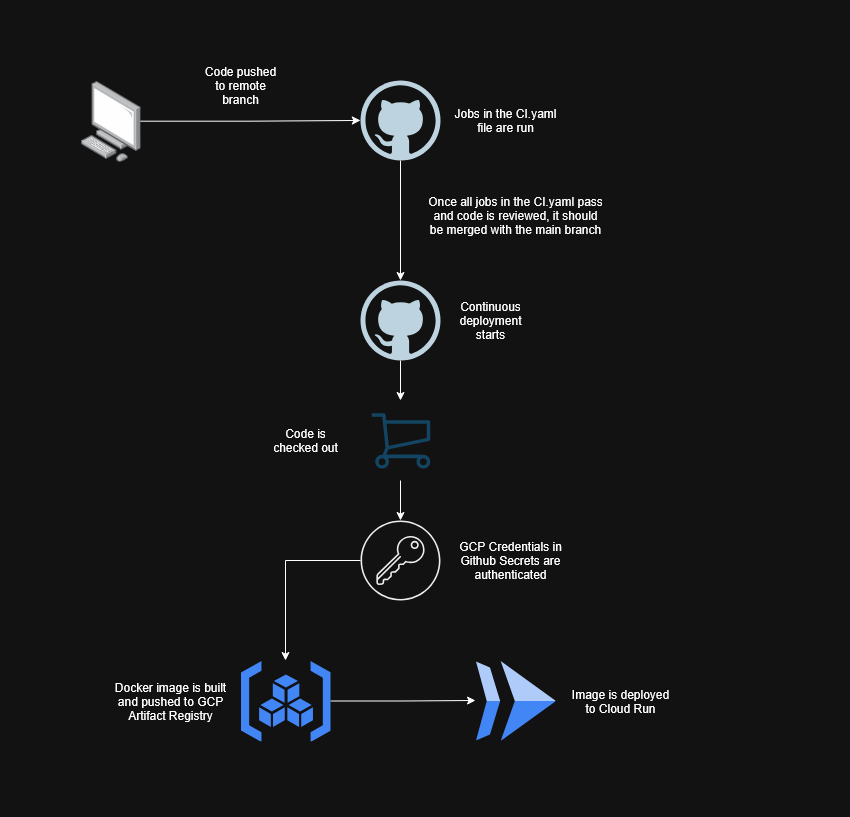

# Update process

I'll be deviating from the deliverable of a Python or Javascript automation script and will be using Github Actions as my Continuous Integration, Continuous Deployment (CICD) pipeline.

Let's say I built the chatbot as a **web API**, using Python, the FastAPI framework and uv as my package manager. To deploy it, I will **containerise** it then use Github Actions to automate deployment of the chatbot as a microservice on **GCP Cloud Run**.

Here is how the general flow would go:
1) Code is pushed to a remote Github branch.
2) The code is **pulled** and **automated testing**, formatting and linting checks are done.
3) When the branch is **merged** to main, the continuous deployment workflow starts.
4) Continuous deployment workflow:
    - Checkout the code
    - Authenticate with GCP credentials
    - Build and push the Docker image to GCP Artifact Registry
    - Deploy it to GCP Cloud Run

Here is the workflow diagram:

Such an approach would not require a rollback capability for failed updates as updates that fail to build during the deployment pipeline would not be deployed to GCP Cloud Run anyways. Furthermore, checks during the integration pipeline like automated testing, linting and formatting checks would prevent potentially failing updates from reaching the deployment pipeline.
